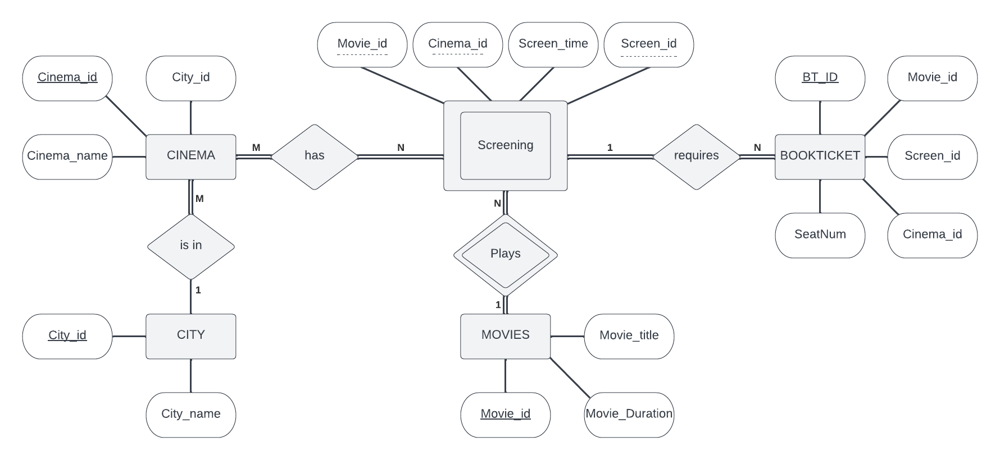

# CSE 3330 – Project #1 – Online Ticketing System  

Database structure for online ticketing system (OTS) that sells movie 
tickets. 

## Table of Contents

- [CSE 3330 – Project #1 – Online Ticketing System](#cse-3330--project-1--online-ticketing-system)
  - [Table of Contents](#table-of-contents)
  - [ER Diagram](#er-diagram)
  - [SQL Create Statements](#sql-create-statements)
    - [BookTicket Table](#bookticket-table)
    - [Cinema Table](#cinema-table)
    - [City Table](#city-table)
    - [Movies Table](#movies-table)
    - [Screening Table](#screening-table)
  - [SQL Import Data Into Tables](#sql-import-data-into-tables)
    - [1. Set output mode to csv](#1-set-output-mode-to-csv)
    - [2. Import data from BookTicket.csv](#2-import-data-from-bookticketcsv)
    - [3. Import data from Cinema.csv](#3-import-data-from-cinemacsv)
    - [4. Import data from City.csv](#4-import-data-from-citycsv)
    - [5. Import data from Movies.csv](#5-import-data-from-moviescsv)
    - [6. Import data from Screening.csv](#6-import-data-from-screeningcsv)
    - [7. Revert output mode back to table](#7-revert-output-mode-back-to-table)
  - [SQL SELECT Statements](#sql-select-statements)
    - [1. Select the movies that are released within a particular city (Arlington)](#1-select-the-movies-that-are-released-within-a-particular-city-arlington)
    - [2. Select all cinemas that are showing a particular movie(Gladiator)](#2-select-all-cinemas-that-are-showing-a-particular-moviegladiator)
    - [3. Select the seats that are booked in all cinemas for a particular movie(Gladiator)](#3-select-the-seats-that-are-booked-in-all-cinemas-for-a-particular-moviegladiator)
    - [4. Select showing times given a specific cinema(Cinemaprism) and movie(Forrest Gump)](#4-select-showing-times-given-a-specific-cinemacinemaprism-and-movieforrest-gump)
    - [5. Select seats available given a movie(Gladiator) and session time(2 pm - 4 pm)](#5-select-seats-available-given-a-moviegladiator-and-session-time2-pm---4-pm)
    - [6. Select the cinema, movie title and times given a reservation number(13)](#6-select-the-cinema-movie-title-and-times-given-a-reservation-number13)
    - [7. Select movie name, movie time, city, and cinema name](#7-select-movie-name-movie-time-city-and-cinema-name)
    - [8. Select movie title and session times with no seats available given a session time(2 pm - 4 pm)](#8-select-movie-title-and-session-times-with-no-seats-available-given-a-session-time2-pm---4-pm)
  - [Contributors](#contributors)


## ER Diagram



## SQL Create Statements

### BookTicket Table
```sql
CREATE TABLE IF NOT EXISTS BOOKTICKET (
  BT_ID int PRIMARY KEY,
  Movie_id int NOT NULL,
  Cinema_id int NOT NULL,
  Screen_id int NOT NULL,
  SeatNum int NOT NULL,
  FOREIGN KEY(Movie_id) REFERENCES MOVIES(Movie_id),
  FOREIGN KEY(Cinema_id) REFERENCES CINEMA(Cinema_id)
);
```

### Cinema Table
```sql
CREATE TABLE IF NOT EXISTS CINEMA (
  Cinema_id int PRIMARY KEY,
  City_id int NOT NULL,
  Cinema_name varchar(255) NOT NULL,
  FOREIGN KEY(City_id) REFERENCES CITY(City_id)
);
```

### City Table
```sql
CREATE TABLE IF NOT EXISTS CITY (
  City_id int PRIMARY KEY,
  City_name varchar(255) NOT NULL
);
```

### Movies Table
```sql
CREATE TABLE IF NOT EXISTS MOVIES (
  Movie_id int PRIMARY KEY,
  Movie_title varchar(255) NOT NULL UNIQUE,
  Movie_Duration int NOT NULL
);
```

### Screening Table
```sql
CREATE TABLE IF NOT EXISTS SCREENING (
  Movie_id INT NOT NULL,
  Cinema_id INT NOT NULL,
  Screen_id INT NOT NULL,
  Screen_time VARCHAR(13) NOT NULL,
  FOREIGN KEY(Movie_id) REFERENCES MOVIES(Movie_id),
  FOREIGN KEY(Cinema_id) REFERENCES CINEMA(Cinema_id)
);
```

## SQL Import Data Into Tables
To import data, we first change the sqlite output mode to csv. Then we import the data from the csv files into the tables with the --csv flag to ignore the headers in the csv files.

### 1. Set output mode to csv 
`.mode csv`

### 2. Import data from BookTicket.csv
`.import ./BookTicket.csv BOOKTICKET --csv`

### 3. Import data from Cinema.csv
`.import ./Cinema.csv CINEMA --csv`

### 4. Import data from City.csv
`.import ./City.csv CITY --csv`

### 5. Import data from Movies.csv
`.import ./Movies.csv MOVIES --csv`

### 6. Import data from Screening.csv
`.import ./Screening.csv SCREENING --csv`

### 7. Revert output mode back to table
`.mode table`

## SQL SELECT Statements
### 1. Select the movies that are released within a <u>particular city</u> (Arlington)
```sql
SELECT MOVIES.Movie_title
FROM MOVIES, CITY, CINEMA, SCREENING
WHERE CITY.City_id = CINEMA.City_id AND
      CINEMA.Cinema_id = SCREENING.Cinema_id AND
      SCREENING.Movie_id = MOVIES.Movie_id AND 
      CITY.City_name = "'Arlington'";
```

### 2. Select all cinemas that are showing a <u>particular movie</u> (Gladiator)
```sql
SELECT DISTINCT CINEMA.Cinema_name, MOVIES.Movie_title
FROM CINEMA, SCREENING, MOVIES 
WHERE CINEMA.Cinema_id = SCREENING.Cinema_id AND
      SCREENING.Movie_id = MOVIES.Movie_id AND
      MOVIES.Movie_title = "'Gladiator'";
```

### 3. Select the seats that are booked in all cinemas for a <u>particular movie</u> (Gladiator)
```sql
SELECT BOOKTICKET.SeatNum
FROM BOOKTICKET, MOVIES
WHERE MOVIES.Movie_id = BOOKTICKET.Movie_id AND
      MOVIES.Movie_title = "'Gladiator'";
```

### 4. Select showing times given a <u>specific cinema</u> (Cinemaprism) and <u>movie</u> (Forrest Gump)
```sql
SELECT SCREENING.Screen_time 
FROM SCREENING, MOVIES, CINEMA
WHERE SCREENING.Cinema_id = CINEMA.Cinema_id AND
      SCREENING.Movie_id = MOVIES.Movie_id AND
      CINEMA.Cinema_name = "'Cinemaprism'" AND
      MOVIES.Movie_title = "'Forrest Gump'";
```

### 5. Select movie title and seat numbers that are reserved given a <u>specific cinema</u> (Fuze Cinema)
```sql
SELECT MOVIES.Movie_title, BOOKTICKET.SeatNum
FROM MOVIES, BOOKTICKET, CINEMA
WHERE Cinema.Cinema_name="'Fuze Cinema'" AND
      BOOKTICKET.Cinema_id=CINEMA.Cinema_id AND
      BOOKTICKET.Movie_id=MOVIES.Movie_id
ORDER BY Movie_title ASC;
```

### 6. Select the cinema, movie title and times given a <u>reservation number</u> (13)
```sql
SELECT CINEMA.Cinema_name, MOVIES.Movie_title, SCREENING.Screen_time
FROM CINEMA, MOVIES, SCREENING, BOOKTICKET
WHERE BOOKTICKET.Cinema_id = CINEMA.Cinema_id AND
      BOOKTICKET.Movie_id = MOVIES.Movie_id AND
      BOOKTICKET.Screen_id = SCREENING.Screen_id AND
      SCREENING.Movie_id = MOVIES.Movie_id AND
      SCREENING.Cinema_id = CINEMA.Cinema_id AND
      BOOKTICKET.BT_ID = 13;
```

### 7. Select movie name, movie time, city, and cinema name
```sql
SELECT MOVIES.Movie_title, SCREENING.Screen_time, CITY.City_name, CINEMA.Cinema_name
FROM MOVIES, SCREENING, CITY, CINEMA
WHERE MOVIES.Movie_id = SCREENING.Movie_id AND
      SCREENING.Cinema_id = CINEMA.Cinema_id AND
      CINEMA.City_id = CITY.City_id;
```

## Contributors
- [Ryan Lahlou](https://github.com/lryanle)
- [Seongjoo Park](https://github.com/paulpark97)
- [Jair Rea](https://github.com/JairRea)
